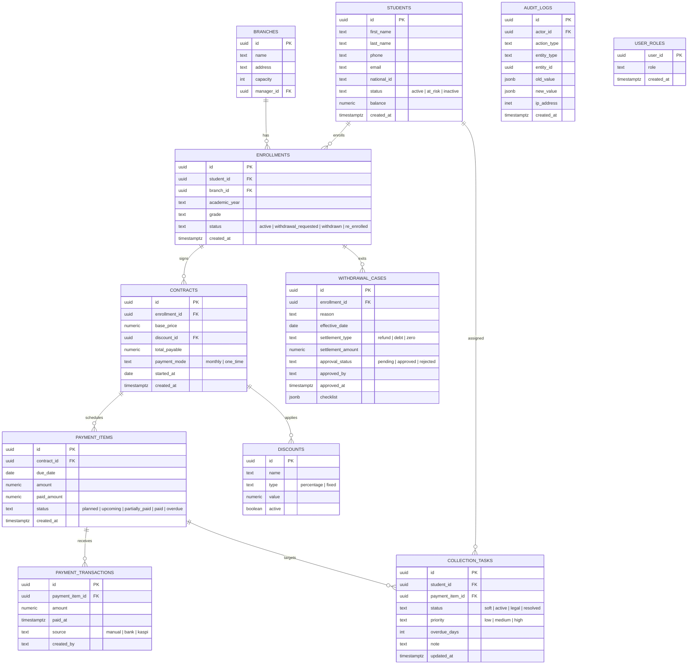
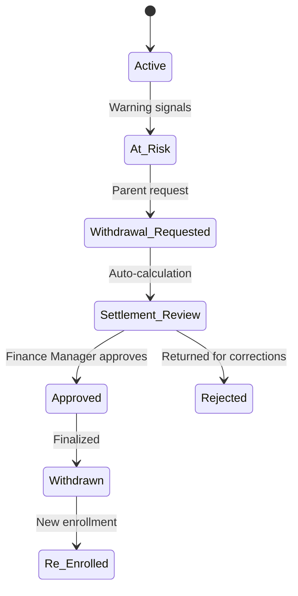

# PRD: Intellect School CRM System

> **Версия**: 2.0  
> **Дата**: 2026-02-27  
> **Статус**: Draft → на утверждение клиента  
> **Стек**: Next.js 15 (App Router) · TypeScript · Supabase · Tailwind CSS · Recharts

---

## 1. Видение продукта

### 1.1 Проблема

Частная школа (~900 учеников, несколько филиалов) управляет контрактами, платежами и взысканием через Google Sheets. Это приводит к:

- потере данных при ручной синхронизации между ассистентом, колл-центром и бухгалтерией;
- отсутствию единого реестра с историей платежей и статусов;
- невозможности оперативно получить аналитику по долгам и прогнозам.

### 1.2 Решение

Единая CRM-система для операционного управления школой: от зачисления ученика до финансовой аналитики. «Golden Record» ученика объединяет личные, академические и финансовые данные.

### 1.3 Целевая аудитория

| Роль | Задачи |
|---|---|
| **Ассистент директора** | Создание профилей, ведение истории, оформление контрактов |
| **Колл-центр** | Контроль долгов, звонки, фиксация результатов |
| **Бухгалтер** | Приём платежей, сверка, выгрузка реестров |
| **Фин. менеджер** | Аналитика, утверждение скидок, отчётность |
| **Админ** | Полный доступ, управление пользователями, аудит |

### 1.4 Масштаб

- ~900 учеников (рост)
- ~150 новых контрактов/мес
- ~10 операторов (рост)
- Несколько филиалов
- Русский язык, web desktop first (1920×1080)

---

## 2. Навигационная карта (Routing)

```
/auth
├── /login                    — Вход в систему
└── /lock                     — Блокировка сессии

/dashboard                    — KPI Constructor (аналитическая панель)

/students
├── /                         — Реестр учеников
├── /:id                      — Профиль ученика (Golden Record)
└── /:id/contract             — Договор и график платежей

/finance
├── /analytics                — Финансовая аналитика
├── /calendar                 — Календарь платежей
└── /discounts                — Справочник цен и скидок

/collections
├── /queue                    — Очередь взыскания (List view)
└── /kanban                   — Очередь взыскания (Board/Kanban view)

/operations
├── /transition               — Перевод на новый учебный год
└── /withdrawal               — Центр выбытия учеников

/reports
└── /builder                  — Конструктор отчётов

/settings
├── /branches                 — Управление филиалами
├── /users                    — Управление пользователями
├── /roles                    — Матрица прав доступа (RBAC)
├── /import                   — Центр импорта/экспорта
├── /audit                    — Журнал аудита
└── /security                 — Настройки безопасности
```

---

## 3. Ролевая модель (RBAC)

| Роль | Модули | Ключевые права |
|---|---|---|
| **Admin** | Все | Полный CRUD, управление ролями, аудит, безопасность |
| **Finance Manager** | Finance, Reports, Pricing, Analytics | Редактирование цен, утверждение скидок, фин. отчётность |
| **Accountant** | Payments, Students, Finance, Reports | Приём платежей, сверка, выгрузка реестров |
| **Call Center** | Collections, Students, Notifications | Просмотр долгов, логирование звонков, смена статусов взыскания |
| **Assistant** | Students, Branches, Transitions | Создание профилей, история обучения, перевод классов |

### Матрица разрешений

| Разрешение | Admin | Finance Mgr | Accountant | Call Center | Assistant |
|---|:---:|:---:|:---:|:---:|:---:|
| students.read | ✅ | ✅ | ✅ | ✅ | ✅ |
| students.write | ✅ | — | — | — | ✅ |
| contracts.read | ✅ | ✅ | ✅ | — | ✅ |
| contracts.write | ✅ | ✅ | — | — | ✅ |
| payments.read | ✅ | ✅ | ✅ | ✅ | — |
| payments.write | ✅ | ✅ | ✅ | — | — |
| collections.read | ✅ | ✅ | — | ✅ | — |
| collections.write | ✅ | — | — | ✅ | — |
| withdrawals.read | ✅ | ✅ | ✅ | ✅ | — |
| withdrawals.write | ✅ | ✅ | ✅ | — | — |
| reports.read | ✅ | ✅ | ✅ | — | — |
| pricing.manage | ✅ | ✅ | — | — | — |
| audit.read | ✅ | ✅ | ✅ | — | — |
| rbac.manage | ✅ | — | — | — | — |
| settings.manage | ✅ | — | — | — | — |

---

## 4. Сущности данных (Data Model)

### 4.1 ER-диаграмма



### 4.2 Ключевые принципы модели

1. **Продольный жизненный цикл** — Student Profile постоянный (1–12 класс), не пересоздаётся каждый год
2. **Enrollment per year** — академическая прогрессия = yearly enrollment records
3. **Contract per enrollment** — контракт привязан к периоду зачисления, не к студенту напрямую
4. **Mid-year joins** — поддержка зачисления в любой месяц, prorated payment plans
5. **Soft-delete** — студенты не удаляются, используются lifecycle-статусы

---

## 5. Детальный разбор модулей

### 5.1 Student Profile — Golden Record (`/students/:id`)

Единая карточка ученика, объединяющая все данные.

**Компоненты:**

| Компонент | Описание |
|---|---|
| `ProfileHeader` | Avatar, ФИО, Status Badge (Active / At Risk / Debt), Quick Actions |
| `AcademicInfo` | Филиал, класс, учебный год, история зачислений |
| `FinanceWidget` | Текущий баланс, сумма следующего платежа, индикатор долга |
| `PaymentSchedule` | Интерактивная таблица: цветовая индикация (🟢 Paid / 🟡 Upcoming / 🔴 Overdue) |
| `ActivityFeed` | Лента последних действий (платежи, звонки, заметки) |
| `ContractPanel` | Условия контракта, скидки, payment mode |

**UX-связи:**
- Из `PaymentSchedule` → открытие `PaymentModal` для внесения денег
- Из `ContractPanel` → переход в `ContractEditor` (`/students/:id/contract`)
- Из `FinanceWidget` → переход в `Finance Analytics` с фильтром по ученику

### 5.2 Contract & Payment Schedule (`/students/:id/contract`)

**Бизнес-логика:**
- Базовая цена контракта варьируется по ученику (не фиксирована)
- Предоплата обязательна
- Режимы: one-time или monthly
- Скидки поддерживаются (процент / фикс)
- Штрафы отсутствуют (клиентское решение)

**Формула расчёта:**
```
total_payable = base_price - discount_amount
monthly_amount = (total_payable - prepayment) / months
```

**Mid-year prorating:**
```
months_remaining = 12 - enrollment_start_month + 1
prorated_total = (base_price / 12) × months_remaining
monthly_amount = (prorated_total - prepayment - discount) / months_remaining
```

### 5.3 Collections Kanban (`/collections/kanban`)

Визуальный конвейер работы с дебиторской задолженностью.

**Колонки Kanban:**

| Колонка | Описание | Автопереход |
|---|---|---|
| **Soft** | 1–15 дней просрочки | Автоматически при overdue |
| **Active** | 16–60 дней, активное взыскание | Ручной перевод оператором |
| **Legal** | 60+ дней, юридические меры | Ручной перевод (только Manager/Admin) |
| **Resolved** | Погашено или списано | При payment.status = paid |

**Компоненты:**
- `KanbanBoard` — drag & drop колонки
- `DebtCard` — сумма долга (красный), дни просрочки, приоритет, последний контакт
- `SideDrawer` — панель фиксации результата звонка (follow-up scenarios)

**Карточка долга (`DebtCard`):**
```json
{
  "studentName": "Ахметов Султан",
  "debtAmount": 45000,
  "overdueDays": 23,
  "priority": "high",
  "lastContact": "2026-02-25",
  "branch": "Филиал Центр",
  "phone": "+7 777 555 55 55"
}
```

### 5.4 Collections Queue (`/collections/queue`)

Та же data, что и Kanban, но в табличном формате.

**Колонки таблицы:**
- Ученик (→ link to profile)
- Филиал
- Сумма долга
- Дней просрочки
- Статус взыскания
- Последний контакт
- Оператор
- Действия (Записать звонок, Изменить статус)

### 5.5 KPI Dashboard (`/dashboard`)

Кастомная аналитика для топ-менеджмента.

**Компоненты:**

| Компонент | Описание |
|---|---|
| `DraggableGrid` | Сетка для drag & drop размещения виджетов |
| `WidgetLibrary` | Доступные метрики: Revenue, Retention, Debt Aging, Collection Rate |
| `ConfigPanel` | Настройка фильтров (филиал, период) и типов графиков (Line / Bar / Gauge / Pie) |

**KPI-виджеты (MVP):**

| Метрика | Формула | Тип |
|---|---|---|
| Общая выручка | Σ paid_amount за период | Number + Trend |
| Дебиторская задолженность | Σ (amount - paid_amount) where status = overdue | Number (red) |
| Collection Rate | (Собрано / План) × 100% | Gauge |
| Retention Rate | (Учеников на конец / На начало) × 100% | Percentage |
| Aging Distribution | Группировка долгов по срокам (0–15, 16–30, 31–60, 60+) | Stacked Bar |
| Платежи на этой неделе | Count where due_date in current week | Number |
| Кейсы выбытия | Count withdrawals за период | Number |

### 5.6 Finance Analytics (`/finance/analytics`)

**Отчёты:**
- План/Факт по месяцам (grouped by branch)
- Aging Report (дебиторская задолженность по срокам)
- Cash Flow прогноз (на основе payment schedule)
- Выручка по филиалам
- Средний чек и дисконт

### 5.7 Finance Calendar (`/finance/calendar`)

Календарное представление платежей:
- Цветовые маркеры: 🟢 оплачено, 🟡 предстоит, 🔴 просрочено
- Фильтр по филиалу и классу
- Клик → PaymentModal

### 5.8 Pricing & Discounts (`/finance/discounts`)

Справочник цен и скидок:
- Базовые цены по грейдам/филиалам
- Типы скидок (процент / фикс)
- Активация/деактивация скидок
- История изменений цен (audit)

### 5.9 Operations — Year Transition (`/operations/transition`)

**Workflow перевода на новый учебный год:**

1. Выбор учебного года (source → target)
2. Массовый перевод: Grade +1, новые enrollments
3. Генерация новых контрактов по шаблону цен
4. Генерация payment schedules
5. Проверка: список учеников без контрактов
6. Подтверждение (Admin / Assistant)

### 5.10 Operations — Withdrawal Center (`/operations/withdrawal`)

**Workflow выбытия:**



**Авто-расчёт возврата:**
```
daily_rate = total_payable / total_days_in_period
remaining_days = effective_date → end_of_period
refund = (daily_rate × remaining_days) - non_refundable_deposit
settlement = paid_amount - earned_amount
  → if positive: refund to parent
  → if negative: debt to collect
```

**Checklist перед архивацией:**
- [ ] Нет непогашенной задолженности
- [ ] Все имущество возвращено
- [ ] Финансовый расчёт утверждён
- [ ] Документы подписаны

### 5.11 Import/Export Center (`/settings/import`)

**Импорт:**
- Форматы: CSV, XLSX
- Маппинг колонок: обязательные поля — `FirstName`, `LastName`, `BranchID`
- Валидация: дубликаты по Email/NationalID, формат дат (YYYY-MM-DD)
- Preview перед применением
- Rollback при ошибках

**Экспорт:**
- Реестр учеников (фильтры: филиал, класс, статус)
- Финансовый реестр (платежи за период)
- Отчёт по долгам
- Журнал аудита

### 5.12 Audit Log (`/settings/audit`)

**Фиксируемые события:**
- Все CRUD-операции над студентами, контрактами, платежами
- Изменения прав доступа
- Вход/выход пользователей
- Изменения цен и скидок

**Поля записи:**
- Actor (кто), Action (что), Entity (над чем), Old/New values, IP, Timestamp

**Фильтры:**
- По пользователю, типу действия, сущности, диапазону дат

---

## 6. Бизнес-логика

### 6.1 Расчёт задолженности

```
debt = Σ (amount - paid_amount)
  WHERE payment_items.status IN ('overdue', 'upcoming')
  AND payment_items.due_date < TODAY
```

### 6.2 Автоматические статусы платежей

| Условие | Статус |
|---|---|
| `due_date > today + 7` | `planned` |
| `due_date <= today + 7 AND due_date >= today` | `upcoming` |
| `due_date < today AND paid_amount = 0` | `overdue` |
| `paid_amount > 0 AND paid_amount < amount` | `partially_paid` |
| `paid_amount >= amount` | `paid` |

### 6.3 Collection Escalation

| Дней просрочки | Приоритет | Канал | Действие |
|---|---|---|---|
| 1–7 | Low | SMS / Push | Автоуведомление |
| 8–15 | Medium | Phone (Soft) | Первый звонок |
| 16–30 | High | Phone (Active) | Активное взыскание |
| 31–60 | High | Phone + Letter | Официальное уведомление |
| 60+ | Critical | Legal | Юридические меры |

### 6.4 Re-enrollment

При повторном зачислении:
- Тот же Student Profile (не создаётся заново)
- Новый Enrollment record
- Новый Contract
- Новый Payment Schedule

---

## 7. Дизайн-система

### 7.1 Цветовая палитра

| Роль | Цвет | HEX |
|---|---|---|
| Primary | Indigo | `#4F46E5` |
| Primary Hover | Dark Indigo | `#4338CA` |
| Success | Emerald | `#10B981` |
| Warning | Amber | `#F59E0B` |
| Danger | Red | `#EF4444` |
| Background | Slate 50 | `#F8FAFC` |
| Surface | White | `#FFFFFF` |
| Text Primary | Slate 900 | `#0F172A` |
| Text Secondary | Slate 500 | `#64748B` |
| Border | Slate 200 | `#E2E8F0` |

### 7.2 Типографика

| Элемент | Font | Size | Weight |
|---|---|---|---|
| H1 | Inter | 28px | 700 |
| H2 | Inter | 22px | 600 |
| H3 | Inter | 18px | 600 |
| Body | Inter | 14px | 400 |
| Small | Inter | 12px | 400 |
| Metric | Inter | 32px | 700 |

### 7.3 Компоненты

- **Скругления**: 12px для контейнеров, 8px для кнопок, 6px для inputs
- **Сетка**: 12-колоночная, оптимизация под 1920×1080
- **Тени**: `0 1px 3px rgba(0,0,0,0.1)` (cards), `0 4px 6px rgba(0,0,0,0.1)` (modals)
- **Графики**: Recharts (Line / Bar / Gauge / Pie)
- **CSS Framework**: Tailwind CSS

---

## 8. Технический стек

| Компонент | Технология |
|---|---|
| **Frontend** | Next.js 15 (App Router), React 19, TypeScript |
| **Styling** | Tailwind CSS |
| **UI Components** | shadcn/ui (Radix primitives) |
| **Tables** | TanStack Table (pagination, sorting, filtering) |
| **Charts** | Recharts |
| **Drag & Drop** | dnd-kit (Kanban, Dashboard grid) |
| **Backend** | Supabase (Postgres, Auth, Storage, RLS) |
| **ORM** | Drizzle ORM |
| **Validation** | Zod |
| **Testing** | Playwright (E2E), Vitest (unit) |

---

## 9. Нефункциональные требования

| Параметр | Требование |
|---|---|
| **Performance** | Загрузка < 2s, API response < 500ms |
| **Scalability** | 1000+ учеников, 50+ concurrent users |
| **Security** | Supabase Auth + RLS, RBAC enforcement, audit logging |
| **Availability** | 99.5% uptime |
| **Backup** | Supabase automated backups |
| **Browser** | Chrome, Edge, Safari (latest 2 versions) |
| **Resolution** | 1920×1080 primary, responsive down to 1366×768 |
| **Language** | Русский (primary), English (future) |

---

## 10. MVP Scope (Фазы)

### Фаза 1 — Core Operations (MVP)

- [x] Auth (login/logout, session lock)
- [x] Student CRUD (реестр, профиль, создание, редактирование)
- [x] Enrollment CRUD
- [x] Contract CRUD
- [x] Payment Items CRUD
- [ ] Payment Transactions CRUD
- [x] Collection Tasks (upsert, status transitions)
- [x] Withdrawal Cases CRUD
- [x] Dashboard (базовые KPI)
- [x] RBAC (5 ролей, серверный enforcement)
- [x] Audit logging
- [x] RLS policies
- [ ] Import/Export (CSV/XLSX)
- [ ] Pagination и фильтрация таблиц

### Фаза 2 — Advanced Operations

- [ ] Collections Kanban (drag & drop)
- [ ] Finance Calendar
- [ ] Pricing & Discounts справочник
- [ ] Year Transition wizard
- [ ] Withdrawal Center (полный approval workflow)
- [ ] Re-enrollment workflow
- [ ] KPI Dashboard (draggable widgets)
- [ ] Finance Analytics (Plan/Fact, Aging, Cash Flow)

### Фаза 3 — Scale & Polish

- [ ] Report Builder (конструктор отчётов)
- [ ] Push/SMS notifications
- [ ] Mobile-responsive improvements
- [ ] Multi-language support (EN)
- [ ] Integration APIs (bank/Kaspi)
- [ ] Advanced security settings

---

## 11. Метрики успеха

| Метрика | Текущее | Целевое | Дедлайн |
|---|---|---|---|
| Время создания контракта | ~15 мин (Sheets) | < 2 мин | Фаза 1 |
| Обновление статуса платежа | ~5 мин (ручной) | Real-time | Фаза 1 |
| Время получения отчёта по долгам | ~30 мин | < 5 сек | Фаза 2 |
| Collection Rate (собираемость) | Неизвестно | > 85% | Фаза 2 |

---

## 12. Риски

| Риск | Вероятность | Влияние | Митигация |
|---|---|---|---|
| Данные в Sheets не чистые для импорта | High | High | Preview + валидация + rollback при импорте |
| Пользователи привыкли к Sheets | Medium | Medium | UX не хуже Sheets, обучающие сессии |
| Рост количества филиалов | Medium | Low | Multi-branch architecture с первого дня |
| Суpabase rate limits при масштабе | Low | Medium | Оптимизация запросов, connection pooling |
| Mid-year prorating edge cases | Medium | High | Покрытие unit-тестами, ручная корректировка |

---

## 13. Open Items (на утверждение клиента)

> [!IMPORTANT]
> Следующие вопросы требуют решения клиента:

1. **Статусный словарь** — утверждение финального набора статусов для каждой сущности
2. **Приоритеты отчётов** — какие отчёты критичны для MVP?
3. **Дата production-запуска** — целевая дата?
4. **Формат ID учеников** — UUID или человеко-читаемый (ST-2023-0042)?
5. **Интеграция Kaspi** — нужна в MVP или post-MVP?
6. **Уведомления** — SMS/Push в MVP или post-MVP?
