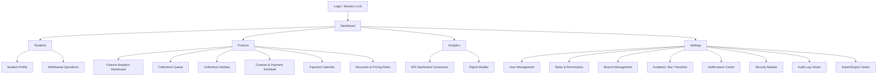

# Единая спецификация интерфейсов SRM Intellect School CRM

> Создана на основе дизайнов Google Stitch · Проект **Srm-intellect** · 19 экранов

---

## 1. Дизайн-система (Design Tokens)

### 1.1 Цветовая палитра

| Токен | HEX | Назначение |
|-------|-----|-----------|
| `primary` | `#5048e5` | Основной акцент, кнопки, активные навигации, ссылки |
| `primary-light` | `#e0e7ff` | Фоновые акценты, лёгкие подсветки |
| `primary-dark` | `#3e38b3` | Hover-состояние кнопок |
| `background-light` | `#f6f6f8` | Основной фон (light mode) |
| `background-dark` | `#121121` | Основной фон (dark mode) |
| `card-bg-dark` | `#1a1a2e` / `#1a192b` | Фон карточек в dark mode |
| `success` | `#078841` | Успех, оплачено, рост |
| `danger` | `#e74008` | Ошибки, просроченная задолженность, критическое |
| `text-main` | `#121117` | Основной текст |
| `text-secondary` | `#656487` | Вторичный текст, подписи |
| `border` | `#dcdce5` | Границы карточек и элементов |

### 1.2 Типографика

| Параметр | Значение |
|----------|---------|
| **Шрифт** | `Inter` (Google Fonts) |
| **Fallback** | `sans-serif` |
| **Начертания** | 400 (Regular), 500 (Medium), 600 (Semibold), 700 (Bold), 800 (Extrabold), 900 (Black) |
| **Заголовок страницы** | `text-2xl` / `text-3xl`, `font-bold`, tracking-tight |
| **Заголовок карточки** | `text-lg`, `font-bold` |
| **Метки полей** | `text-xs`, `uppercase`, `tracking-wide`, `font-semibold` |
| **Основной текст** | `text-sm`, `font-medium` |
| **Мелкий текст** | `text-xs` |

### 1.3 Иконки

- **Библиотека**: Material Symbols Outlined (Google Fonts)
- **Стиль**: outlined, wght 400, FILL 0 (по умолчанию), FILL 1 для активных
- **Размер навигации**: `text-xl` / `text-2xl`
- **Размер inline**: `text-[16px]` — `text-[20px]`

### 1.4 Скругления (border-radius)

| Токен | Значение | Применение |
|-------|---------|-----------|
| `DEFAULT` | `0.5rem` (8px) | Инпуты, кнопки, бейджи |
| `lg` | `0.75rem` — `1rem` | Карточки, модальные окна |
| `xl` | `0.75rem` — `1.5rem` | Контейнеры секций |
| `full` | `9999px` | Аватары, статус-бейджи, скругления |

### 1.5 Тени

| Тип | Значение |
|-----|---------|
| Карточка | `shadow-sm` |
| Кнопка primary | `shadow-lg shadow-primary/30` |
| Модальное окно / Login | `shadow-2xl` |

---

## 2. Общая структура макета (Layout)

### 2.1 Sidebar (Боковая навигация)

```
┌──────────────────┐
│  Logo + Title    │
│  (school icon)   │
├──────────────────┤
│  Dashboard       │
│  Students        │  ← active: bg-primary/10 text-primary
│  Teachers        │
│  Finance         │
│  Schedule        │
├──────────────────┤
│  -- Settings --  │  ← divider + section label
│  User Mgmt       │
│  General Settings│
├──────────────────┤
│  User Profile    │  ← bottom area
│  Logout          │
└──────────────────┘
```

- **Ширина**: `w-64` (256px)
- **Position**: `fixed left-0 top-0 h-screen`
- **Фон**: `bg-white` / `bg-[#1a1a2e]` (dark)
- **Граница**: `border-r border-slate-200`
- **Скрытие на mobile**: `hidden md:flex` / `hidden lg:flex`
- **Навигационный элемент**:
  - Неактивный: `text-slate-500 hover:text-primary hover:bg-slate-50`
  - Активный: `bg-primary/10 text-primary`
  - Паддинг: `px-3 py-2.5`, `rounded-xl` / `rounded-lg`
  - Gap: `gap-3` (icon + label)

### 2.2 Main Content Area

- **Offset**: `ml-64` (когда sidebar visible)
- **Padding**: `p-6 lg:p-10` или `p-6 md:p-8`
- **Max-width**: `max-w-7xl mx-auto` или `max-w-[1400px]`
- **Overflow**: `overflow-y-auto h-screen`

### 2.3 Header (Top Bar)

Присутствует в экранах с управлением:
- **Высота**: `h-16`
- **Содержимое**: Breadcrumbs слева, Actions (notifications + user profile) справа
- **Sticky**: `sticky top-0 z-20`
- **Граница**: `border-b border-border-color`

### 2.4 Page Header

```
Breadcrumbs: Settings > User Management
Title (h1):  User Management                    [+ Add New User]
Subtitle:    Manage access and permissions...
```

- Заголовок: `text-2xl font-bold text-text-main tracking-tight`
- Подзаголовок: `text-text-secondary mt-1`
- Кнопка действия: `bg-primary text-white px-5 py-2.5 rounded-lg`

---

## 3. Спецификации экранов

### 3.1 🔐 Login и Session Lock


**Маршрут**: `/login`, `/session-lock`

**Компоновка Login**: Split-screen (50/50)
- **Левая часть**: Gradient mesh background (`bg-mesh`), лого с иконкой `school`, большой заголовок (text-5xl font-black), описание
- **Правая часть**: Форма (Email, Password, Remember me, Sign In, SSO)

**Компоненты**:
- `EmailInput`: полный width, `px-4 py-3`, rounded-lg, border
- `PasswordInput`: с кнопкой visibility toggle
- `PrimaryButton`: `w-full bg-primary py-4 rounded-lg font-bold shadow-lg`
- `SSOButton`: `bg-slate-50 border py-3 rounded-lg` + Google logo
- `Divider`: «Or continue with» separator

**Session Lock**: Modal поверулённого фона
- Blur-backdrop, стеклянный эффект (`backdrop-blur-xl`)
- Аватар с lock-badge, имя, роль, input пароля
- «Sign out and switch user» link

---

### 3.2 👤 Student Profile Details


**Маршрут**: `/students/:id`

**Layout**: Grid 3 колонки (`lg:grid-cols-3`)
- Левая (2/3): General Info, Contacts & Guardians, Education History
- Правая (1/3): Financial Overview, Quick Actions, Recent Activity

**Компоненты**:
- **ProfileCard**: Avatar (128px rounded-full), имя, статус-badge (Active/Inactive), grid с метаданными (Grade, Branch, Enrolled, Roll No, Advisor)
- **ContactCard**: Icon-circle + Name/Role + Phone/Email в grid layout
- **EducationTable**: Columns: Year, Grade, Attendance (progress bar), GPA, Action
- **FinancialCard**: Balance (text-4xl font-black), status badge, next payment info
- **QuickActions**: 2x2 grid кнопок (Invoice, Pay, Task, Note) с icon-circle hover
- **ActivityTimeline**: Вертикальная линия с цветными dots и текстом

---

### 3.3 🏢 Advanced Branch Management


**Маршрут**: `/settings/branches`

**Компоненты**:
- **BranchCard**: Белая карточка с иконкой филиала, названием, адресом, count учеников/учителей
- **BranchForm**: Modal/drawer для создания/редактирования филиала
- **MapView**: Визуализация расположения филиалов
- **StatusIndicator**: Active/Inactive toggle

---

### 3.4 🔑 Roles & Permissions Management


**Маршрут**: `/settings/roles`

**Компоненты**:
- **RoleCard**: Название роли, count пользователей, список основных permissions
- **PermissionMatrix**: Таблица с toggle-switches (Read/Write/Delete) по модулям
- **RoleForm**: Создание/редактирование роли с checkbox-группами по модулям
- **UserAssignment**: Список пользователей, назначенных на роль

---

### 3.5 📊 KPI Dashboard Constructor


**Маршрут**: `/analytics/kpi`

**Компоненты**:
- **KPIWidgetGrid**: Drag-and-drop grid для виджетов
- **KPIWidget**: Конфигурируемая карточка (тип, метрика, период)
- **WidgetSelector**: Panel/drawer с доступными виджетами
- **PeriodFilter**: Dropdown выбора периода (This Quarter, Year, Custom)
- **ChartWidget**: Inline SVG charts (line, bar, donut)

---

### 3.6 📅 Academic Year Transition Management


**Маршрут**: `/settings/academic-year`

**Компоненты**:
- **YearTimeline**: Горизонтальный таймлайн учебных годов
- **TransitionWizard**: Multi-step wizard (rollover settings)
- **GradeMapping**: Drag-and-drop маппинг классов для перехода
- **StatusPanel**: Текущий год, следующий год, прогресс перехода

---

### 3.7 📋 Collections Queue


**Маршрут**: `/finance/collections`

**Компоненты**:
- **QueueTable**: Основная таблица должников (Student, Amount, Days Overdue, Status, Actions)
- **StatusBadge**: `Critical` (red), `Pending` (orange), `Active` (primary)
- **FilterBar**: Search + Filter + Sort controls
- **BulkActions**: Мульти-выбор + действия (Send Reminder, Assign, Export)
- **DebtorDetail**: Side panel с подробностями о задолженности

---

### 3.8 🗂 Collections Advanced Kanban


**Маршрут**: `/finance/collections/kanban`

**Компоненты**:
- **KanbanBoard**: Горизонтальный scroll с колонками (New, In Progress, Follow-up, Resolved)
- **KanbanColumn**: Заголовок + count + drag target
- **KanbanCard**: Student name, amount, days, priority badge, assignee avatar
- **QuickFilter**: Tabs для филиалов + timeline filter

---

### 3.9 📄 Report Builder Management


**Маршрут**: `/analytics/reports`

**Компоненты**:
- **ReportList**: Таблица/grid сохранённых отчётов
- **ReportBuilder**: Визуальный конструктор (выбор полей, фильтров, группировки)
- **PreviewPanel**: Live preview отчёта
- **ExportOptions**: PDF, Excel, CSV export кнопки
- **ScheduleReport**: Автоматическая отправка по расписанию

---

### 3.10 🔍 Audit Log Viewer


**Маршрут**: `/settings/audit-log`

**Компоненты**:
- **LogTable**: Columns — Timestamp, User, Action, Module, Details, IP
- **FilterPanel**: Date range, User filter, Action type, Module filter
- **LogDetail**: Expandable row с JSON diff (before/after)
- **ExportButton**: Export filtered logs

---

### 3.11 💰 Contract & Payment Schedule


**Маршрут**: `/students/:id/contract`, `/finance/contracts`

**Компоненты**:
- **ContractCard**: Номер контракта, сумма, сроки, статус
- **PaymentSchedule**: Timeline/list будущих платежей с status indicators
- **PaymentRow**: Дата, amount, type (Tuition/Transport/Meals), paid/unpaid badge
- **ContractForm**: Modal для создания/обновления контракта
- **PaymentHistory**: Table с history платежей + receipt download

---

### 3.12 📥 Import Export Center


**Маршрут**: `/settings/import-export`

**Компоненты**:
- **ImportWizard**: Multi-step: Select File → Map Fields → Preview → Import
- **ExportBuilder**: Выбор модуля, полей, формата (CSV, Excel, PDF)
- **DropZone**: Drag-and-drop area для файлов с validation
- **ProgressBar**: Прогресс импорта/экспорта с статусами
- **HistoryList**: Таблица прошлых операций импорта/экспорта

---

### 3.13 📈 Finance Analytics Dashboard


**Маршрут**: `/finance/analytics`

**Компоненты**:
- **KPICardGrid**: 4-column grid (Total Revenue, Outstanding Debt, Collection Rate, Projected Revenue)
  - Icon circle с bg-primary/10, trend badge (↑12% success, ↓5% danger)
  - Value: `text-2xl font-bold`
- **RevenueChart**: Area chart (SVG) с gradient fill, revenue vs target
- **BranchBarChart**: Vertical bar chart с hover tooltips
- **DebtorTable**: Top 3 крупнейших должников (name, grade, amount, days overdue, status badge)
- **PaymentDonutChart**: CSS conic-gradient donut (Online 45%, Bank 25%, Cash 30%)
- **BranchFilter**: `<select>` dropdown
- **PeriodFilter**: `<select>` (This Quarter, Year)

---

### 3.14 🛡 Admin Security Module


**Маршрут**: `/settings/security`

**Компоненты**:
- **PasswordPolicy**: Настройки сложности пароля (min length, uppercase, special chars)
- **SessionSettings**: Timeout, max sessions, IP whitelist
- **2FAConfig**: Toggle + QR code для двухфакторной аутентификации
- **SecurityLog**: Последние security-события
- **BackupSettings**: Автобэкап, расписание, storage destination

---

### 3.15 🔔 Notifications Center


**Маршрут**: `/notifications`

**Компоненты**:
- **NotificationList**: Вертикальный список с type-icon, title, body, timestamp
- **NotificationCard**: Unread (bold border-l-primary), read (muted)
- **FilterTabs**: All, Payments, System, Alerts
- **NotificationSettings**: Channel preferences (email, push, in-app) per event type
- **TemplateEditor**: Редактор шаблонов уведомлений

---

### 3.16 🚪 Withdrawal Operations Center


**Маршрут**: `/students/withdrawal`

**Компоненты**:
- **WithdrawalTable**: Student, Reason, Status (Pending/Approved/Rejected), Date
- **WithdrawalForm**: Multi-step form (Reason, Financial Settlement, Documents, Confirmation)
- **ApprovalWorkflow**: Checklist of required approvals (Finance, Academic, Admin)
- **SettlementCalc**: Auto-calculated refund/remaining balance
- **DocumentChecklist**: Checkbox list of required documents

---

### 3.17 👥 User Management Admin


**Маршрут**: `/settings/users`

**Компоненты**:
- **StatsCards**: 3-column grid (Total Users, Active Sessions, Pending Invites)
  - Background icon watermark (opacity-10), trend indicators
- **SearchBar**: Icon search + Filter button + Export button
- **UserTable**: Avatar + Name + Email, Role badge, Branch, Last Login, Active toggle, Actions menu
  - Role badges: Admin (primary), Accountant (emerald), Teacher (blue), Call Center (purple)
  - Status toggle: peer-checked checkbox styled as switch
- **Pagination**: «Showing 1 to 5 of 14» + page numbers
- **AddUserModal**: Form для создания нового пользователя

---

### 3.18 📆 Payment Calendar Management


**Маршрут**: `/finance/calendar`

**Компоненты**:
- **CalendarView**: Month grid с payment markers (due dates, paid, overdue)
- **DayDetail**: Side panel при клике на дату (список платежей за этот день)
- **PaymentSummary**: Карточки с итогами по выбранному периоду
- **UpcomingPayments**: List вложенных карточек ближайших платежей

---

### 3.19 🏷 Discounts & Pricing Rules


**Маршрут**: `/finance/discounts`

**Компоненты**:
- **DiscountTable**: Name, Type (Percentage/Fixed), Value, Applicable To, Active toggle
- **PricingMatrix**: Grid по классам × тип оплаты (Tuition, Transport, Meals)
- **DiscountForm**: Modal с условиями (min grade, sibling, scholarship)
- **RuleBuilder**: Visual rule builder для автоматических скидок
- **PreviewCalc**: Калькулятор итоговой суммы с применёнными скидками

---

## 4. Общие UI-паттерны

### 4.1 Таблицы (DataTable)

```css
/* Header */
thead: bg-background-light dark:bg-white/5
th: px-6 py-3, text-xs, uppercase, font-semibold, text-secondary, tracking-wider

/* Body */
tbody: divide-y divide-border
tr: hover:bg-background-light dark:hover:bg-white/5, transition-colors
td: px-6 py-4, text-sm

/* Pagination */
Showing {from} to {to} of {total} results  [< 1 2 3 >]
Active page: bg-primary/10 border-primary text-primary
```

### 4.2 Формы (Form Controls)

```css
/* Input */
input: w-full px-4 py-3 rounded-lg border border-border bg-white
       focus:ring-2 focus:ring-primary focus:border-transparent
       text-sm, transition-all, outline-none

/* Label */
label: text-sm font-semibold text-slate-700 mb-2

/* Select */
select: appearance-none bg-white border rounded-lg pl-3 pr-10 py-2.5
        + chevron icon absolute right-2

/* Toggle/Switch */
width: w-11 h-6, rounded-full, peer-checked:bg-primary
thumb: w-5 h-5, rounded-full, bg-white, transition
```

### 4.3 Кнопки

| Тип | Стилизация |
|-----|-----------|
| **Primary** | `bg-primary hover:bg-primary/90 text-white font-bold py-2.5 px-5 rounded-lg shadow-lg shadow-primary/30` |
| **Secondary** | `bg-white border border-border text-text-main hover:bg-slate-50 rounded-lg` |
| **Danger** | `bg-red-600 hover:bg-red-700 text-white` |
| **Ghost** | `text-primary hover:underline font-medium` |
| **Icon-only** | `p-2 rounded-full hover:bg-background-light text-secondary` |

### 4.4 Карточки (Cards)

```css
card: bg-white dark:bg-[#1a1a2e]
      rounded-xl p-5/p-6 
      shadow-sm 
      border border-border/50
```

### 4.5 Status Badges

| Статус | Стиль |
|--------|------|
| Active / Success | `bg-green-100 text-green-700 border-green-200` |
| Pending / Warning | `bg-orange-100 text-orange-600` |
| Critical / Error | `bg-danger/10 text-danger` |
| Info / Default | `bg-primary/10 text-primary` |
| Neutral | `bg-slate-100 text-slate-600` |

Формат: `px-2.5 py-0.5 rounded-full text-xs font-semibold`

### 4.6 Dark Mode

Полная поддержка dark mode через Tailwind `dark:` prefix:
- `darkMode: "class"` в tailwind config
- Toggle кнопка: `document.documentElement.classList.toggle('dark')`
- Фоны: `bg-background-dark` (#121121), карточки: `bg-[#1a1a2e]`
- Текст: `dark:text-white`, `dark:text-slate-400`
- Границы: `dark:border-slate-700`/`dark:border-slate-800`

---

## 5. Навигационная структура (Sitemap)



---

## 6. Технический стек и рекомендации

### 6.1 Используемый стек в прототипах

| Технология | Версия / Источник |
|-----------|------------------|
| Tailwind CSS | CDN v3 (`cdn.tailwindcss.com`) |
| Google Fonts | Inter (400–900) |
| Icons | Material Symbols Outlined |
| Charts | CSS/SVG inline (conic-gradient, SVG path) |

### 6.2 Рекомендации для реализации

| Аспект | Рекомендация |
|--------|-------------|
| **Framework** | Next.js (App Router) — уже используется в проекте |
| **UI Library** | Headless UI / Radix UI + Tailwind для доступных компонентов |
| **Charts** | Recharts или Chart.js для реальных графиков |
| **Tables** | TanStack Table для сортировки, фильтрации, пагинации |
| **Forms** | React Hook Form + Zod validation |
| **State** | Zustand / React Context для глобального состояния |
| **API** | Supabase (уже интегрирован в проект) |
| **Icons** | `@material-design-icons/svg` или `react-icons/md` |
| **Dark Mode** | `next-themes` + Tailwind darkMode: "class" |
| **i18n** | Добавить ru/en локализацию через next-intl |

---

## 7. Файловая структура экранов

### Исходники

| # | Экран | Скриншот | HTML-код |
|---|-------|---------|----------|
| 1 | Student Profile Details | [screenshot](./screenshots/01_student_profile.png) | [html](./html/01_student_profile.html) |
| 2 | Advanced Branch Management | [screenshot](./screenshots/02_branch_management.png) | [html](./html/02_branch_management.html) |
| 3 | Roles & Permissions Management | [screenshot](./screenshots/03_roles_permissions.png) | [html](./html/03_roles_permissions.html) |
| 4 | KPI Dashboard Constructor | [screenshot](./screenshots/04_kpi_dashboard.png) | [html](./html/04_kpi_dashboard.html) |
| 5 | Academic Year Transition | [screenshot](./screenshots/05_academic_year.png) | [html](./html/05_academic_year.html) |
| 6 | Collections Advanced Kanban | [screenshot](./screenshots/06_collections_kanban.png) | [html](./html/06_collections_kanban.html) |
| 7 | Report Builder Management | [screenshot](./screenshots/07_report_builder.png) | [html](./html/07_report_builder.html) |
| 8 | Audit Log Viewer | [screenshot](./screenshots/08_audit_log.png) | [html](./html/08_audit_log.html) |
| 9 | Contract & Payment Schedule | [screenshot](./screenshots/09_contract_payment.png) | [html](./html/09_contract_payment.html) |
| 10 | Import Export Center | [screenshot](./screenshots/10_import_export.png) | [html](./html/10_import_export.html) |
| 11 | Finance Analytics Dashboard | [screenshot](./screenshots/11_finance_analytics.png) | [html](./html/11_finance_analytics.html) |
| 12 | Admin Security Module | [screenshot](./screenshots/12_admin_security.png) | [html](./html/12_admin_security.html) |
| 13 | Notifications Center | [screenshot](./screenshots/13_notifications.png) | [html](./html/13_notifications.html) |
| 14 | Login and Session Lock | [screenshot](./screenshots/14_login_session.png) | [html](./html/14_login_session.html) |
| 15 | Withdrawal Operations Center | [screenshot](./screenshots/15_withdrawal.png) | [html](./html/15_withdrawal.html) |
| 16 | User Management Admin | [screenshot](./screenshots/16_user_management.png) | [html](./html/16_user_management.html) |
| 17 | Payment Calendar Management | [screenshot](./screenshots/17_payment_calendar.png) | [html](./html/17_payment_calendar.html) |
| 18 | Discounts & Pricing Rules | [screenshot](./screenshots/18_discounts_pricing.png) | [html](./html/18_discounts_pricing.html) |
| 19 | Collections Queue | [screenshot](./screenshots/19_collections_queue.png) | [html](./html/19_collections_queue.html) |

---

> **Проект**: Srm-intellect · **Stitch ID**: 7195875739981059867
> **Устройство**: Desktop (2560×2048)
> **Дизайн-тема**: Light / Dark · Font: Manrope/Inter · Color: #137fec/#5048e5 · Roundness: 8px
